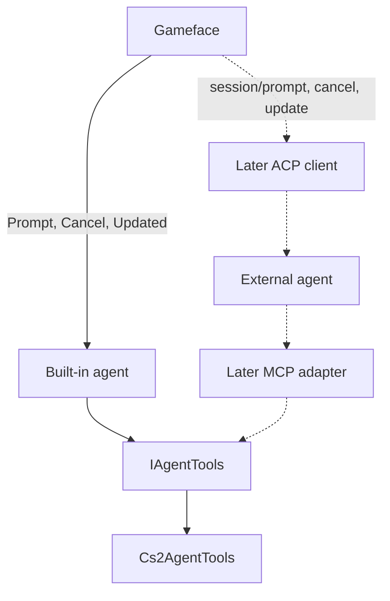

# AIRI Mayor


> Learn more at [Project AIRI](https://github.com/moeru-ai/airi) and the [live demo](https://airi.moeru.ai).

**AIRI Mayor** plays **Cities: Skylines II**. A Gameface chat in the game talks to a C# loop that builds on the simulation thread. There is no external agent process. Not listed on Paradox Mods yet; the intended install is the mod store plus an API key.

- Vocabulary: [CONTEXT.md](./CONTEXT.md)
- Decisions: [docs/adr/](./docs/adr/)
- Open work: [docs/open-work.md](docs/open-work.md)
- Agent rules: [AGENTS.md](./AGENTS.md)
- Docs index: [docs/README.md](./docs/README.md)

## Session

Gameface calls `Prompt`, `Cancel`, and the `update` stream on the built-in agent. City tools pass through `IAgentTools`. Solid lines are that loop. Dashed lines are a later arrangement: those same calls go to an external agent over ACP (`session/prompt`, `session/cancel`, `session/update`), and city tools are handed to it as MCP. See [ADR 0032](docs/adr/0032-agent-runtime-tool-port.md).



## Build

Windows + the game. Full setup: [Windows onboarding](docs/guide/2026-08-06-windows-onboarding.md).

```bash
cd Mod
dotnet build
```

Enable **AIRI Mayor**, load a save; chat is bottom-right. UI-only: `cd Mod/UI && npm run build`. Offline POCs: [archive/](./archive/README.md).

## License

[Apache License 2.0](./LICENSE). The tool layer is an inlined adaptation of [CS2MCP](https://github.com/LancerComet/cities-skylines-2-mcp); attribution is in [NOTICE](./NOTICE). Portions of `CreateDefinitions.cs` remain under the Paradox Interactive EULA.
